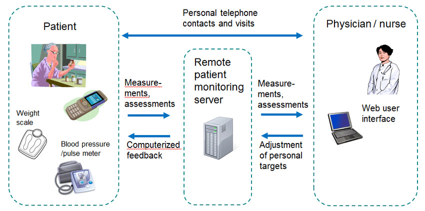

## Key Problem in HealthCare:

## Remote Patient Monitoring (RPM)

# Definition :

Remote patient monitoring is a technology to enable monitoring of patients outside of conventional clinical settings, such as in the home or in a remote area, which may increase access to care and decrease healthcare delivery costs.

---

# Why RPC ?

With the rise of chronic diseases and the need for continuous care, especially in rural or underserved areas, remote patient monitoring (RPM) has become increasingly important.

---

# Problems in RPC :

Existing solutions often suffer from issues like data fragmentation, lack of real-time analytics, and poor integration with healthcare systems, making it challenging for healthcare providers to deliver timely and effective care.

---

# Proposed Solution :

It is an integrated RPM system that enables healthcare providers to monitor patients remotely through wearable devices and IoT sensors. The system will collect real-time health data (e.g., heart rate, blood pressure, glucose levels), analyze it using AI algorithms, and provide actionable insights to both patients and healthcare providers. The system will also feature alerts and notifications for critical health events, ensuring timely interventions.

---

# Architectural Overview :

1.Frontend (React.js):

Technology: React.js
Reason: React.js is ideal for building a responsive and intuitive user interface that allows healthcare providers to monitor patient data in real-time. Patients can also use a mobile or web application to view their health data, receive alerts, and communicate with their healthcare providers.

---

2.Backend (Node.js + Express.js):

Technology: Node.js with Express.js
Reason: Node.js’s asynchronous nature is well-suited for handling real-time data streams from multiple IoT devices. Express.js simplifies the creation of RESTful APIs, which are essential for integrating the RPM system with other healthcare applications, such as Electronic Health Records (EHRs).

---

3.Database (MongoDB):

Technology: MongoDB
Reason: MongoDB’s flexible schema allows it to handle the varied and often unstructured data generated by IoT devices. This includes time-series data like heart rate over time or glucose levels, which can be stored and queried efficiently.

---

4.IoT and Wearable Integration:

Technology: MQTT (Message Queuing Telemetry Transport) and WebSockets
Reason: MQTT is a lightweight messaging protocol that is ideal for communication between IoT devices and the backend. WebSockets enable real-time data updates, allowing healthcare providers to receive immediate alerts if a patient’s vital signs go outside safe parameters.

---

5.Data Analytics and AI:

Technology: Python-based AI/ML models integrated via Node.js
Reason: AI and machine learning models can analyze the incoming health data in real-time to detect patterns and predict potential health issues. These models can be developed in Python and integrated with the Node.js backend to provide real-time insights and recommendations.

---

6.Security and Compliance:

Technology: End-to-End Encryption, JWT for Authentication, and HIPAA Compliance
Reason: Ensuring data privacy and security is crucial in healthcare. End-to-end encryption ensures that sensitive health data is protected during transmission. JWT provides secure and scalable authentication, while the system is designed to comply with HIPAA regulations to ensure patient data is handled according to legal standards.

---

# Benefits:

1.Continuous Monitoring: Patients with chronic conditions receive continuous care, reducing hospital visits and improving quality of life.
2.Timely Interventions: Real-time data and alerts enable healthcare providers to intervene quickly during critical events, potentially saving lives.
3.Scalability: The system can scale to accommodate large numbers of patients and devices, making it suitable for widespread deployment.

---

# Below is the Architectural Diagram for RPM :

---
